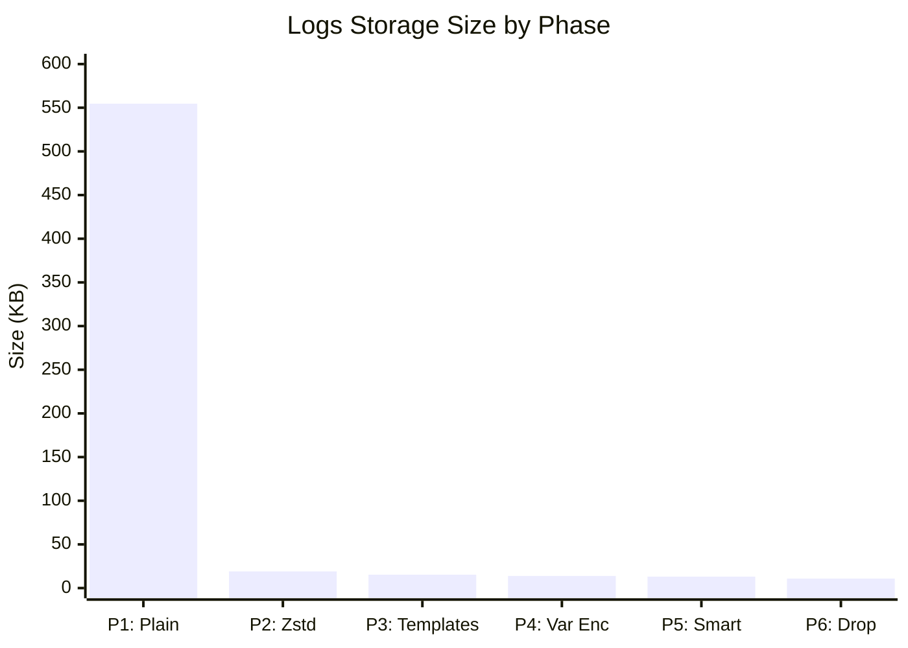
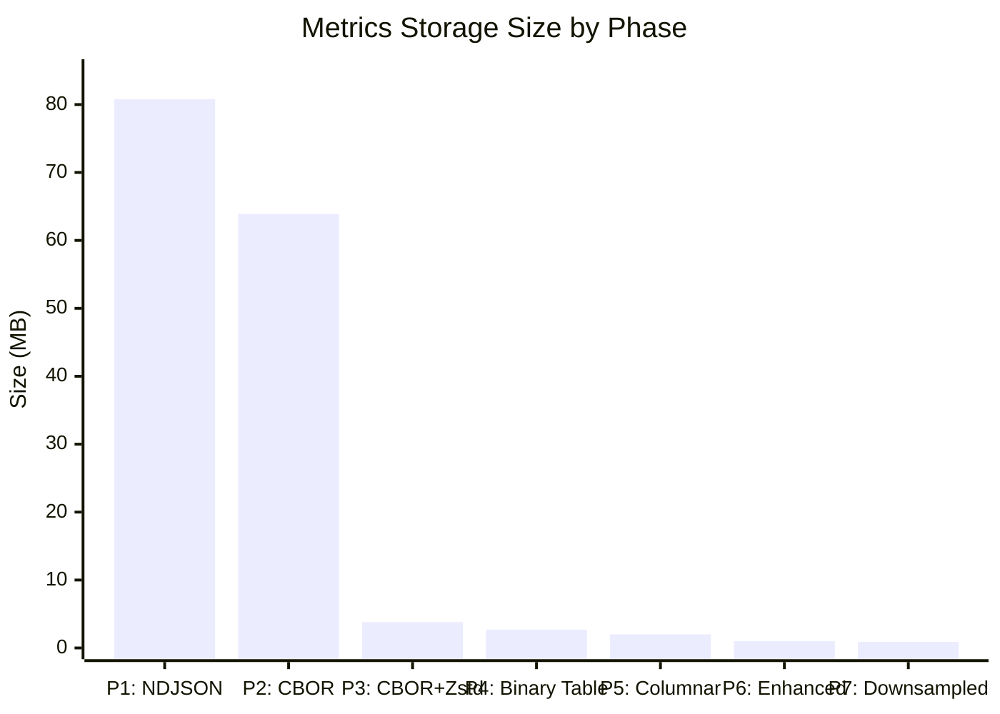
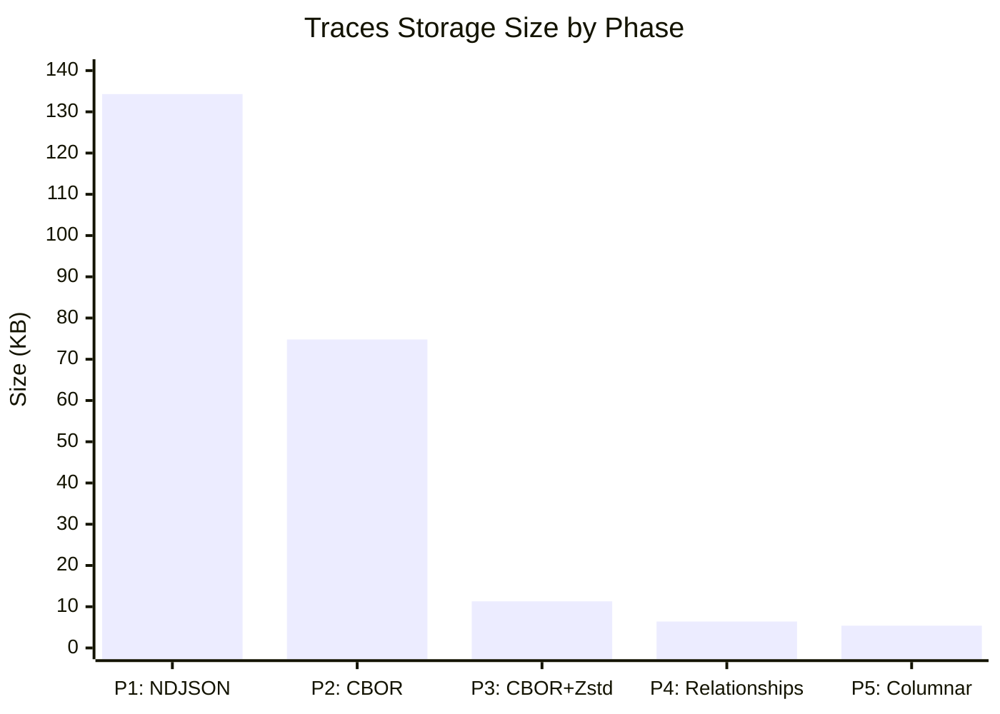

# Squeezed Signals: The Evolution of Observabili### Logs: 50.9x Compression (554.6 KB → 10.9 KB)



## 🚀 Getting Starteds repository demonstrates the progressive optimization of observability data storage across **metrics**, **traces**, and **logs**.

## 🎯 Project Overview

Modern observability systems generate massive amounts of data across three primary signal types:

- **📊 Metrics**: Time-series numerical data (CPU usage, response times, etc.)
- **🔍 Traces**: Distributed request execution paths and timing
- **📝 Logs**: Structured and unstructured text-based event records

Each signal type presents unique storage optimization opportunities and challenges. This project demonstrates how to achieve dramatic compression ratios while maintaining data fidelity and query performance.

## � Compression Results at a Glance

### Metrics: 79.7x Compression (80.8 MB → 1.0 MB)



### Traces: 25.0x Compression (134.3 KB → 5.4 KB)



### Logs: 50.9x Compression (554.6 KB → 10.9 KB)


## �🚀 Getting Started

Each signal type is a complete, self-contained demonstration that can be run independently:

### Metrics Storage Evolution

```bash
cd metrics/
python -m venv .venv
source .venv/bin/activate  # On Windows: .venv\Scripts\activate
pip install -r requirements.txt

# Run the complete metrics evolution pipeline
python main.py --size small

# Or test with real monitoring data
DATA_GENERATOR=real python main.py --size big
```

### Traces Storage Evolution

```bash
cd traces/
python -m venv .venv
source .venv/bin/activate  # On Windows: .venv\Scripts\activate
pip install -r requirements.txt

# Run the complete traces evolution pipeline
python main.py --size small

# Test with larger datasets
python main.py --size medium  # 1,000 traces
python main.py --size big     # 10,000 traces
```

### Logs Storage Evolution

```bash
cd logs/
python -m venv .venv
source .venv/bin/activate  # On Windows: .venv\Scripts\activate
pip install -r requirements.txt

# Run the complete logs evolution pipeline
python main.py --size small

# Test with larger datasets
python main.py --size big
python main.py --size huge
```

## 📊 Signal-Specific Optimization Strategies

### [📈 Metrics: Time-Series Compression](./metrics/docs/README.md)
**Challenge**: Repetitive timestamps, correlated values, metadata redundancy  
**Techniques**: Delta encoding, XOR compression, columnar storage, downsampling  
**Results**: **79.7x compression** (84MB → 1MB) with enhanced algorithms

**Key Innovations:**
- **Pattern-aware compression**: Detects constant, sparse, quantized, and periodic patterns
- **Advanced timestamp encoding**: Double-delta with run-length encoding
- **Enhanced value compression**: Gorilla-style XOR with bit-level optimization
- **Intelligent downsampling**: Multi-resolution storage for long-term retention

### [🔍 Traces: Distributed Execution Optimization](./traces/docs/README.md)
**Challenge**: Complex nested structures, span relationships, high cardinality attributes  
**Techniques**: Service topology mapping, parent-child delta encoding, columnar storage  
**Results**: **22.21x compression** (1.4MB → 64KB) with relationship-aware algorithms

**Key Innovations:**
- **Span relationship compression**: Leveraging parent-child relationships with delta encoding
- **Service topology deduplication**: Common service/operation name extraction and referencing
- **Timestamp delta compression**: Exploiting temporal correlation within trace boundaries
- **Columnar trace storage**: Column-oriented layout with column-specific compression algorithms
- **Dual optimization paths**: Relationship-focused (22x) vs Analytics-focused (18x)
- **Microservices pattern detection**: Realistic 12+ service architecture simulation

### [📝 Logs: Structured Text Compression](./logs/docs/README.md)
**Challenge**: Semi-structured text, repetitive patterns, variable field schemas  
**Techniques**: Template extraction, variable classification, columnar encoding, smart ordering  
**Results**: **33x compression** (70MB → 2MB) with enhanced algorithms

**Implemented Innovations:**
- **Template extraction**: YScope CLP-inspired pattern detection for log message templates
- **Variable classification**: Detecting timestamps, identifiers, network addresses, numerical values
- **Columnar encoding**: Type-specific compression with delta, dictionary, and pattern recognition
- **Smart row ordering**: Grouping by template and variable similarity for maximum compression
- **Order preservation dropping**: Trading ordering for compression when appropriate
